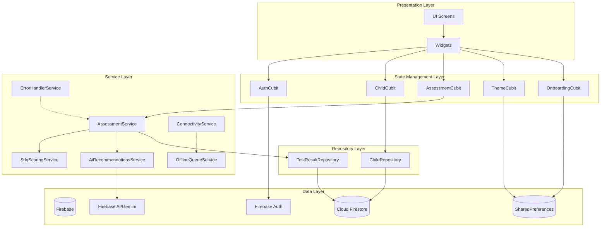
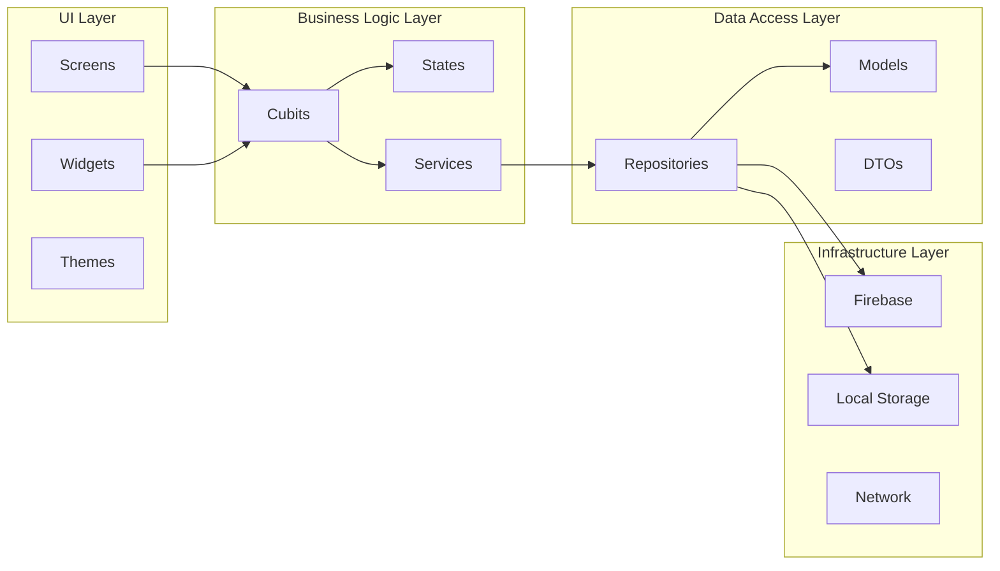
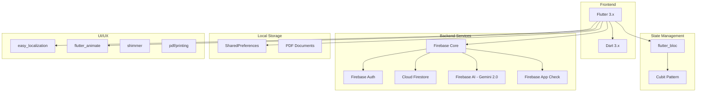

# App Architecture Diagram

## High-Level Architecture



## Layered Architecture



## Folder Structure

```
lib/
├── core/
│   ├── config/           # App configuration
│   ├── constants/        # Constants & questions
│   ├── di/               # Dependency injection
│   ├── exceptions/       # Custom exceptions
│   ├── repositories/     # Repository interfaces
│   ├── services/         # Business services
│   ├── theme/            # App theming
│   ├── utils/            # Utilities
│   └── widgets/          # Shared widgets
├── cubit/
│   ├── auth/             # Authentication state
│   ├── assessment/       # Assessment state
│   ├── child/            # Child management state
│   ├── onboarding/       # Onboarding state
│   └── theme/            # Theme state
├── data/
│   └── repositories/     # Repository implementations
├── models/               # Data models
├── screens/              # UI screens
│   ├── auth/             # Auth screens
│   ├── child/            # Child screens
│   ├── home/             # Home screen
│   ├── legal/            # Legal screens
│   ├── onboarding/       # Onboarding screens
│   ├── settings/         # Settings screen
│   └── splash/           # Splash screen
└── widgets/              # Shared widgets
```

## Technology Stack


