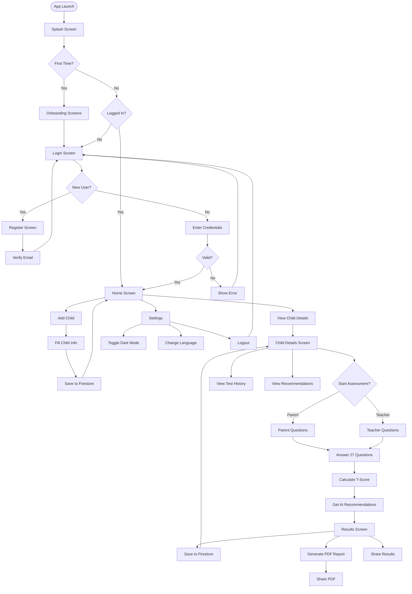
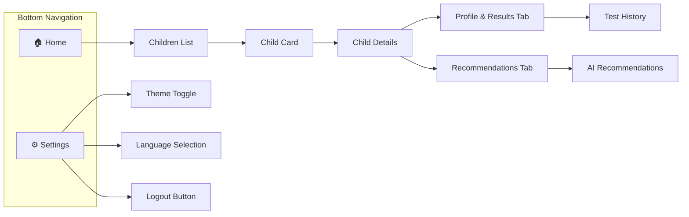
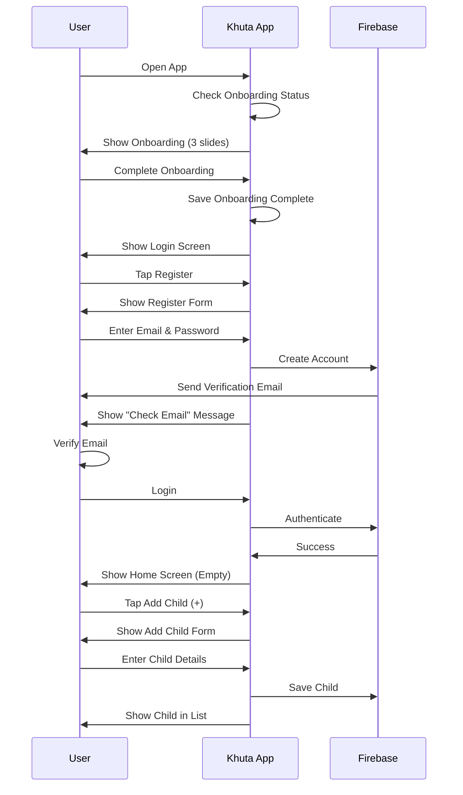
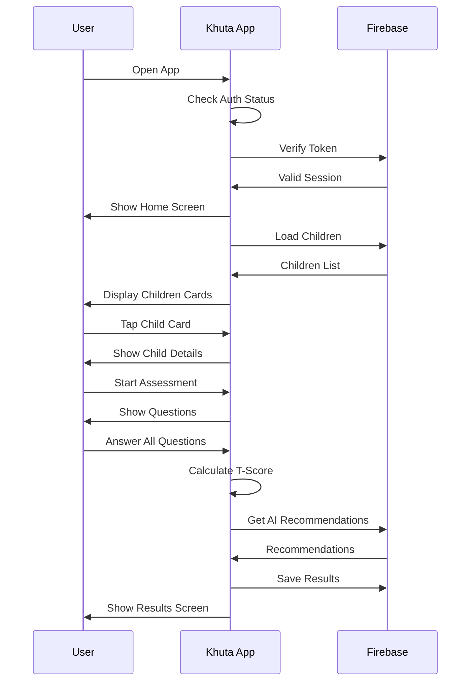

# User Flow Diagrams

## Complete User Journey

```mermaid
flowchart TD
    Start([App Launch]) --> Splash[Splash Screen]
    Splash --> CheckOnboarding{First Time?}

    CheckOnboarding -->|Yes| Onboarding[Onboarding Screens]
    CheckOnboarding -->|No| CheckAuth{Logged In?}

    Onboarding --> Login[Login Screen]

    CheckAuth -->|Yes| Home[Home Screen]
    CheckAuth -->|No| Login

    Login --> Register{New User?}
    Register -->|Yes| RegisterScreen[Register Screen]
    Register -->|No| LoginAction[Enter Credentials]

    RegisterScreen --> VerifyEmail[Verify Email]
    VerifyEmail --> Login

    LoginAction --> Authenticate{Valid?}
    Authenticate -->|No| LoginError[Show Error]
    LoginError --> Login
    Authenticate -->|Yes| Home

    Home --> AddChild[Add Child]
    Home --> ViewChild[View Child Details]
    Home --> Settings[Settings]

    AddChild --> FillForm[Fill Child Info]
    FillForm --> SaveChild[Save to Firestore]
    SaveChild --> Home

    ViewChild --> ChildDetails[Child Details Screen]
    ChildDetails --> StartAssessment{Start Assessment?}
    ChildDetails --> ViewHistory[View Test History]
    ChildDetails --> ViewRecommendations[View Recommendations]

    StartAssessment -->|Parent| ParentAssessment[Parent Questions]
    StartAssessment -->|Teacher| TeacherAssessment[Teacher Questions]

    ParentAssessment --> AnswerQuestions[Answer 27 Questions]
    TeacherAssessment --> AnswerQuestions

    AnswerQuestions --> CalculateScore[Calculate T-Score]
    CalculateScore --> GetAIRecommendations[Get AI Recommendations]
    GetAIRecommendations --> ResultsScreen[Results Screen]

    ResultsScreen --> SaveResults[Save to Firestore]
    ResultsScreen --> GeneratePDF[Generate PDF Report]
    ResultsScreen --> ShareResults[Share Results]

    SaveResults --> ChildDetails
    GeneratePDF --> SharePDF[Share PDF]

    Settings --> ChangeTheme[Toggle Dark Mode]
    Settings --> ChangeLanguage[Change Language]
    Settings --> Logout[Logout]

    Logout --> Login
```

## Main Navigation Flow

```mermaid
flowchart LR
    subgraph "Bottom Navigation"
        Home[🏠 Home]
        Settings[⚙️ Settings]
    end

    Home --> ChildList[Children List]
    ChildList --> ChildCard[Child Card]
    ChildCard --> ChildDetails[Child Details]

    ChildDetails --> ProfileTab[Profile & Results Tab]
    ChildDetails --> RecommendationsTab[Recommendations Tab]

    ProfileTab --> TestHistory[Test History]
    RecommendationsTab --> AIRecommendations[AI Recommendations]

    Settings --> ThemeToggle[Theme Toggle]
    Settings --> LanguageSelect[Language Selection]
    Settings --> LogoutBtn[Logout Button]
```

## First-Time User Flow

```mermaid
sequenceDiagram
    participant U as User
    participant App as Khuta App
    participant Firebase as Firebase

    U->>App: Open App
    App->>App: Check Onboarding Status
    App->>U: Show Onboarding (3 slides)
    U->>App: Complete Onboarding
    App->>App: Save Onboarding Complete
    App->>U: Show Login Screen
    U->>App: Tap Register
    App->>U: Show Register Form
    U->>App: Enter Email & Password
    App->>Firebase: Create Account
    Firebase->>U: Send Verification Email
    App->>U: Show "Check Email" Message
    U->>U: Verify Email
    U->>App: Login
    App->>Firebase: Authenticate
    Firebase->>App: Success
    App->>U: Show Home Screen (Empty)
    U->>App: Tap Add Child (+)
    App->>U: Show Add Child Form
    U->>App: Enter Child Details
    App->>Firebase: Save Child
    App->>U: Show Child in List
```

## Returning User Flow

```mermaid
sequenceDiagram
    participant U as User
    participant App as Khuta App
    participant Firebase as Firebase

    U->>App: Open App
    App->>App: Check Auth Status
    App->>Firebase: Verify Token
    Firebase->>App: Valid Session
    App->>U: Show Home Screen
    App->>Firebase: Load Children
    Firebase->>App: Children List
    App->>U: Display Children Cards
    U->>App: Tap Child Card
    App->>U: Show Child Details
    U->>App: Start Assessment
    App->>U: Show Questions
    U->>App: Answer All Questions
    App->>App: Calculate T-Score
    App->>Firebase: Get AI Recommendations
    Firebase->>App: Recommendations
    App->>Firebase: Save Results
    App->>U: Show Results Screen
```
