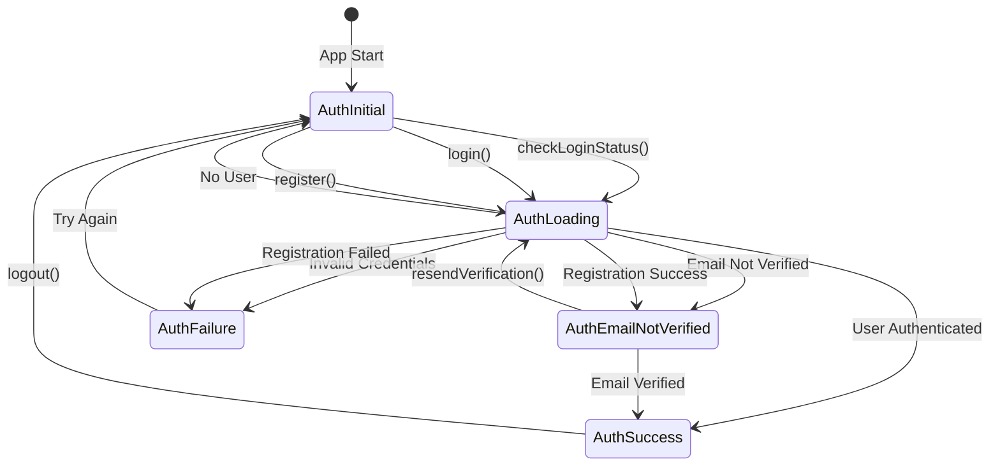
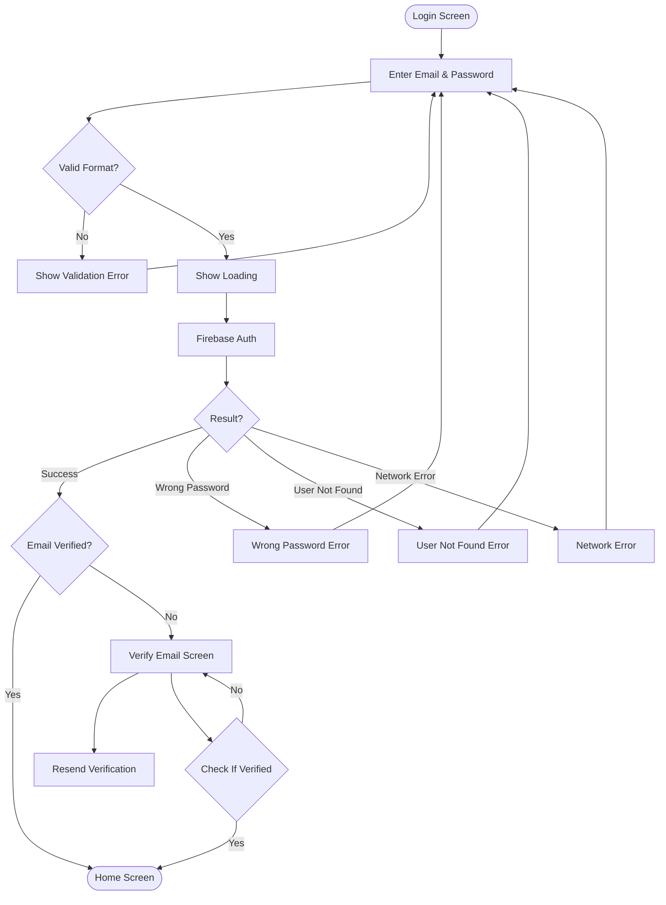
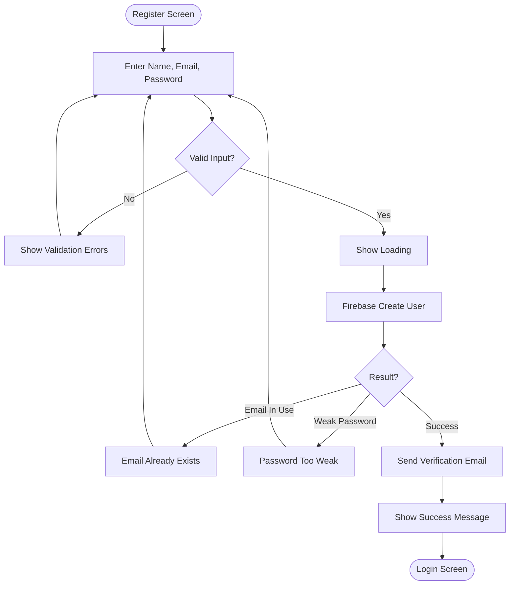
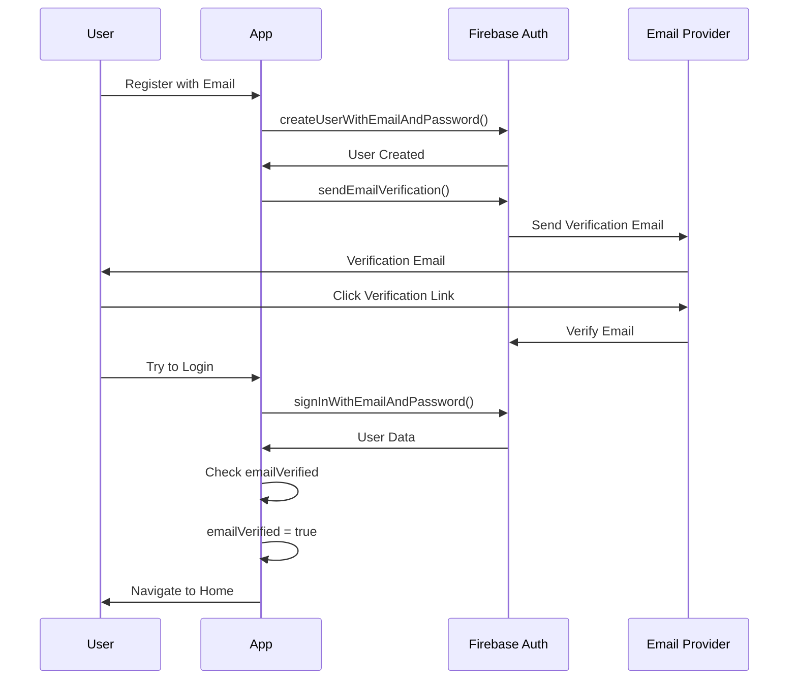
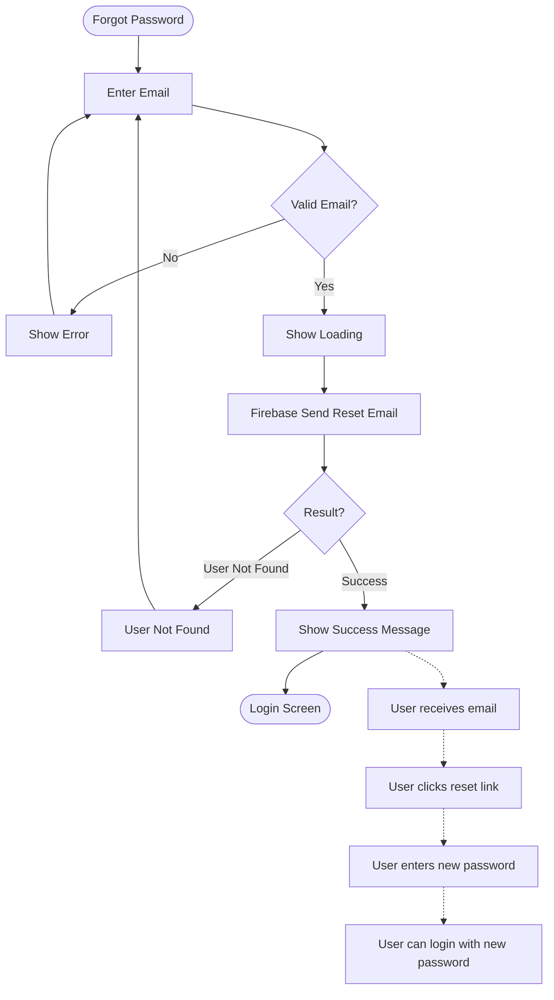
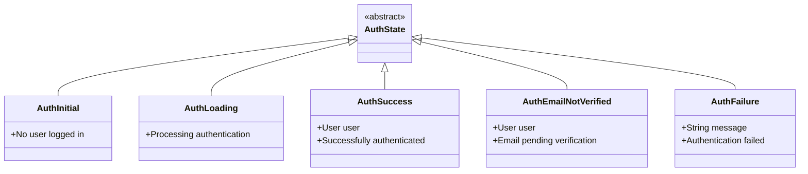

# Authentication Flow Diagrams

## Authentication State Machine

```mermaid
stateDiagram-v2
    [*] --> AuthInitial: App Start

    AuthInitial --> AuthLoading: checkLoginStatus()
    AuthLoading --> AuthSuccess: User Authenticated
    AuthLoading --> AuthInitial: No User

    AuthInitial --> AuthLoading: login()
    AuthLoading --> AuthEmailNotVerified: Email Not Verified
    AuthLoading --> AuthFailure: Invalid Credentials

    AuthEmailNotVerified --> AuthLoading: resendVerification()
    AuthEmailNotVerified --> AuthSuccess: Email Verified

    AuthFailure --> AuthInitial: Try Again

    AuthSuccess --> AuthInitial: logout()

    AuthInitial --> AuthLoading: register()
    AuthLoading --> AuthEmailNotVerified: Registration Success
    AuthLoading --> AuthFailure: Registration Failed
```

## Login Flow

```mermaid
flowchart TD
    Start([Login Screen]) --> EnterCredentials[Enter Email & Password]
    EnterCredentials --> Validate{Valid Format?}

    Validate -->|No| ShowValidationError[Show Validation Error]
    ShowValidationError --> EnterCredentials

    Validate -->|Yes| Loading[Show Loading]
    Loading --> FirebaseAuth[Firebase Auth]

    FirebaseAuth --> AuthResult{Result?}

    AuthResult -->|Success| CheckEmail{Email Verified?}
    AuthResult -->|Wrong Password| WrongPwd[Wrong Password Error]
    AuthResult -->|User Not Found| NotFound[User Not Found Error]
    AuthResult -->|Network Error| NetworkErr[Network Error]

    WrongPwd --> EnterCredentials
    NotFound --> EnterCredentials
    NetworkErr --> EnterCredentials

    CheckEmail -->|Yes| Success([Home Screen])
    CheckEmail -->|No| VerifyScreen[Verify Email Screen]

    VerifyScreen --> ResendEmail[Resend Verification]
    VerifyScreen --> CheckVerified{Check If Verified}
    CheckVerified -->|Yes| Success
    CheckVerified -->|No| VerifyScreen
```

## Registration Flow

```mermaid
flowchart TD
    Start([Register Screen]) --> EnterInfo[Enter Name, Email, Password]
    EnterInfo --> ValidateForm{Valid Input?}

    ValidateForm -->|No| ShowErrors[Show Validation Errors]
    ShowErrors --> EnterInfo

    ValidateForm -->|Yes| Loading[Show Loading]
    Loading --> CreateAccount[Firebase Create User]

    CreateAccount --> Result{Result?}

    Result -->|Email In Use| EmailExists[Email Already Exists]
    Result -->|Weak Password| WeakPwd[Password Too Weak]
    Result -->|Success| SendVerification[Send Verification Email]

    EmailExists --> EnterInfo
    WeakPwd --> EnterInfo

    SendVerification --> ShowMessage[Show Success Message]
    ShowMessage --> LoginScreen([Login Screen])
```

## Email Verification Flow

```mermaid
sequenceDiagram
    participant U as User
    participant App as App
    participant Auth as Firebase Auth
    participant Email as Email Provider

    U->>App: Register with Email
    App->>Auth: createUserWithEmailAndPassword()
    Auth->>App: User Created
    App->>Auth: sendEmailVerification()
    Auth->>Email: Send Verification Email
    Email->>U: Verification Email

    U->>Email: Click Verification Link
    Email->>Auth: Verify Email

    U->>App: Try to Login
    App->>Auth: signInWithEmailAndPassword()
    Auth->>App: User Data
    App->>App: Check emailVerified
    App->>App: emailVerified = true
    App->>U: Navigate to Home
```

## Password Reset Flow

```mermaid
flowchart TD
    Start([Forgot Password]) --> EnterEmail[Enter Email]
    EnterEmail --> Validate{Valid Email?}

    Validate -->|No| ShowError[Show Error]
    ShowError --> EnterEmail

    Validate -->|Yes| Loading[Show Loading]
    Loading --> SendReset[Firebase Send Reset Email]

    SendReset --> Result{Result?}

    Result -->|User Not Found| NotFound[User Not Found]
    Result -->|Success| ShowSuccess[Show Success Message]

    NotFound --> EnterEmail
    ShowSuccess --> LoginScreen([Login Screen])

    Note1[User receives email]
    Note2[User clicks reset link]
    Note3[User enters new password]
    Note4[User can login with new password]

    ShowSuccess -.-> Note1
    Note1 -.-> Note2
    Note2 -.-> Note3
    Note3 -.-> Note4
```

## AuthCubit State Diagram

```mermaid
classDiagram
    class AuthState {
        <<abstract>>
    }

    class AuthInitial {
        +No user logged in
    }

    class AuthLoading {
        +Processing authentication
    }

    class AuthSuccess {
        +User user
        +Successfully authenticated
    }

    class AuthEmailNotVerified {
        +User user
        +Email pending verification
    }

    class AuthFailure {
        +String message
        +Authentication failed
    }

    AuthState <|-- AuthInitial
    AuthState <|-- AuthLoading
    AuthState <|-- AuthSuccess
    AuthState <|-- AuthEmailNotVerified
    AuthState <|-- AuthFailure
```
