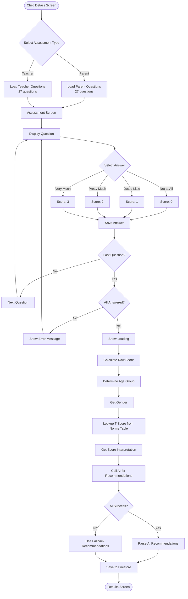
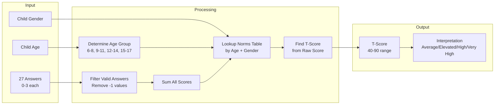
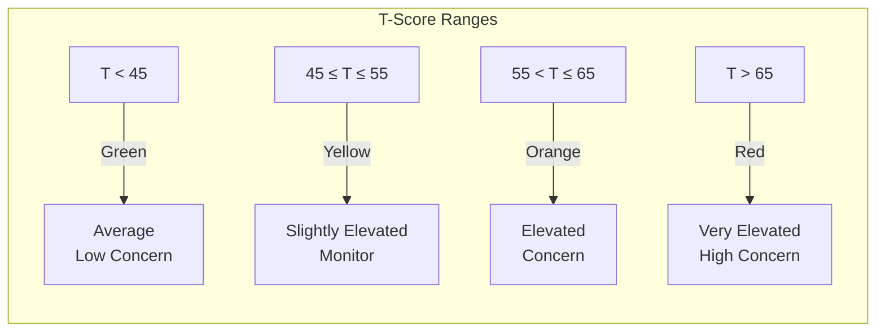
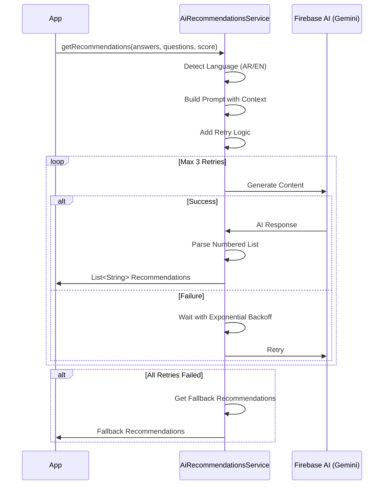
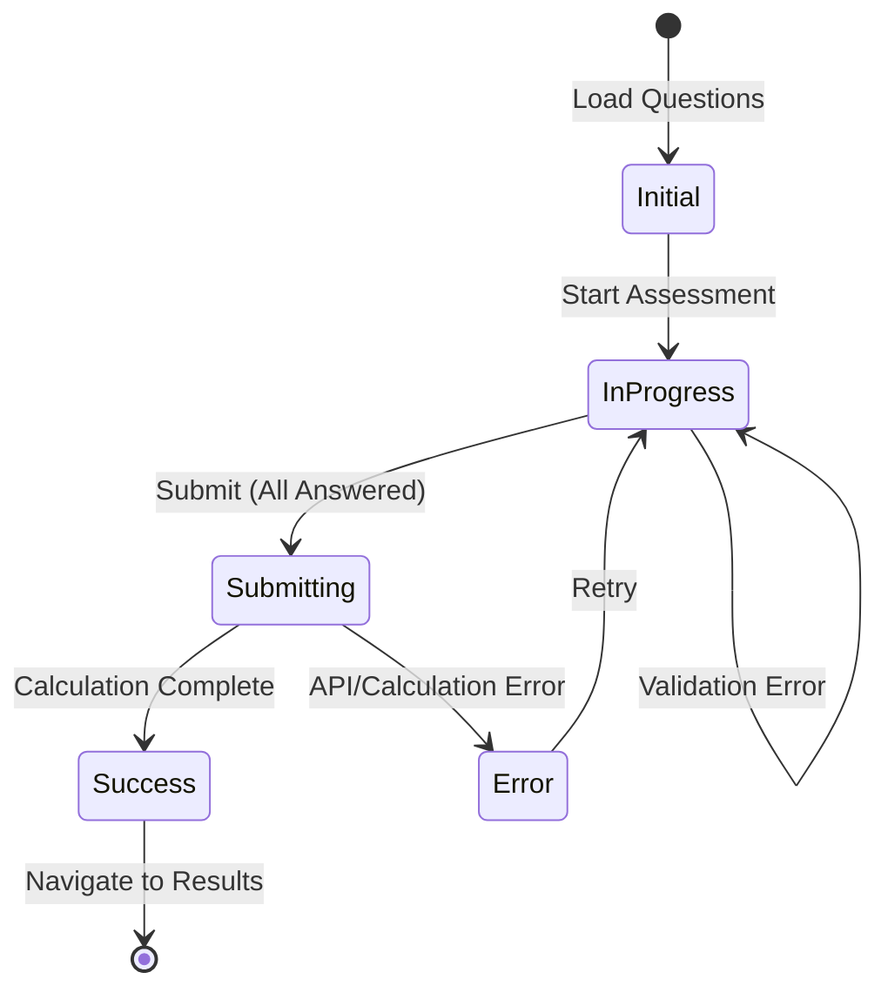
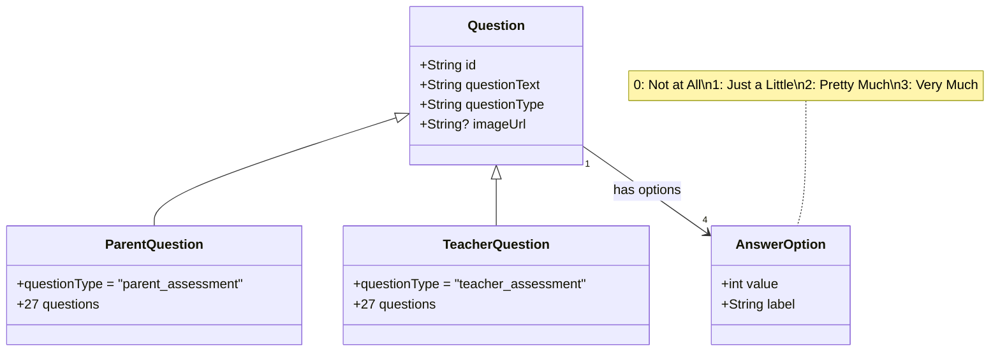
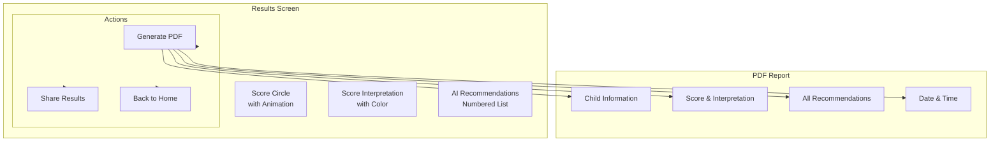

# Assessment Flow Diagrams

## Complete Assessment Flow

## T-Score Calculation Process

## Score Interpretation

## AI Recommendations Flow

## Assessment State Machine

## Question Types

## Results Display

