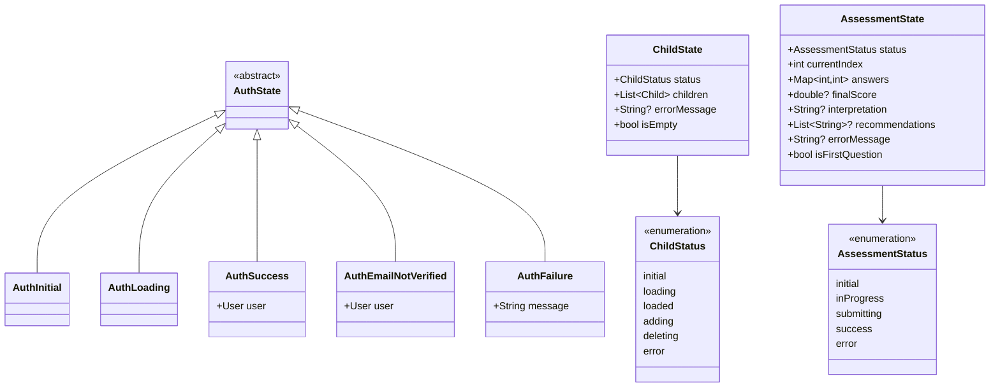

# State Management Diagrams

## BLoC Architecture Overview

## AuthCubit State Flow

## ChildCubit State Flow

## AssessmentCubit State Flow

## State Classes

## Cubit Dependencies

## MultiBlocProvider Setup

## State Updates Example

