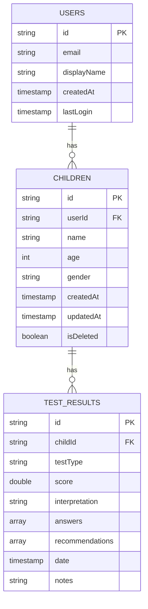
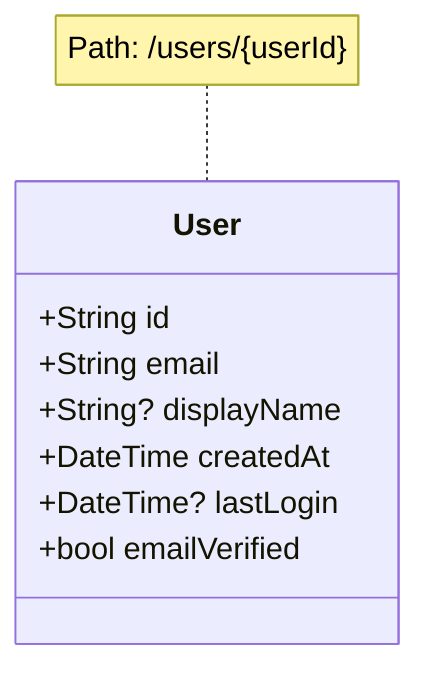
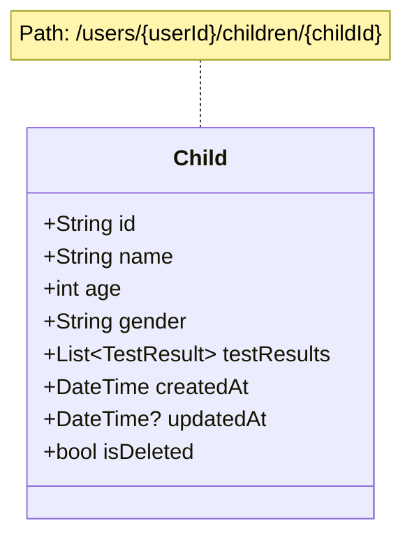
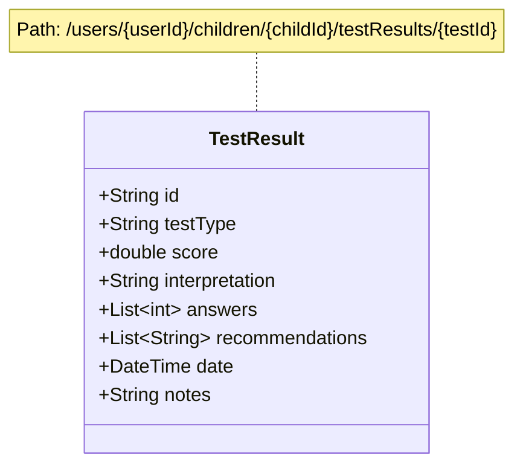
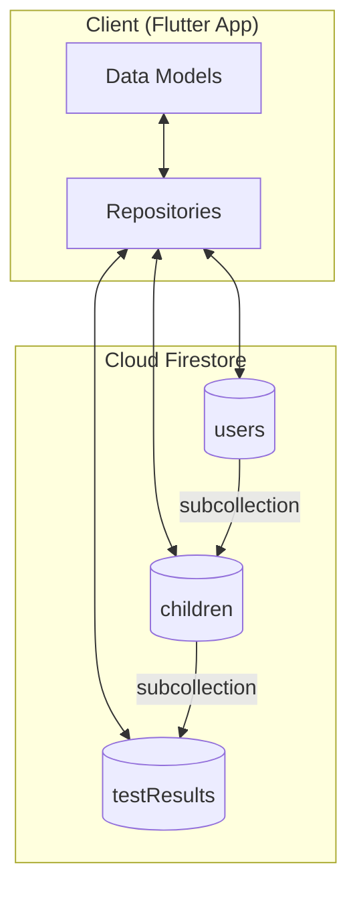
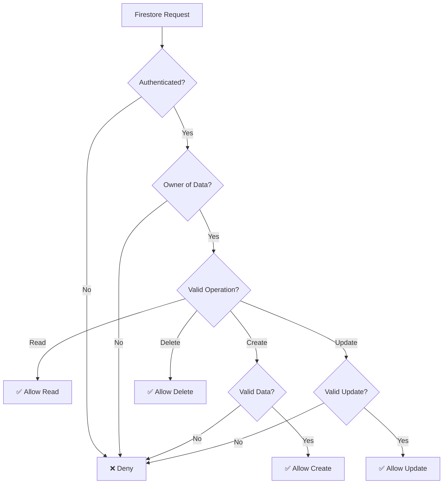
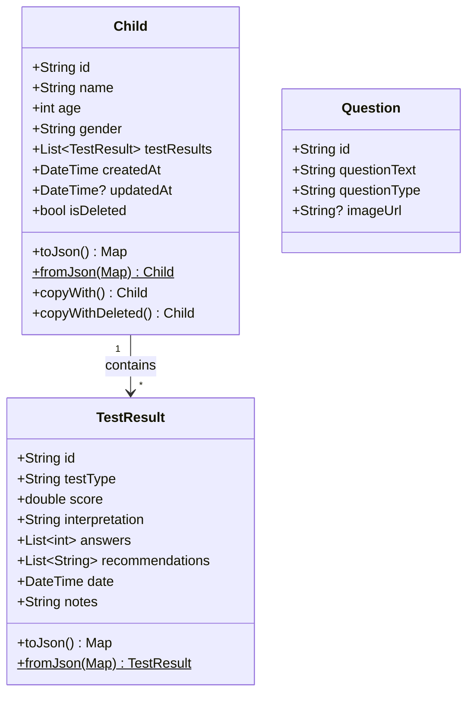
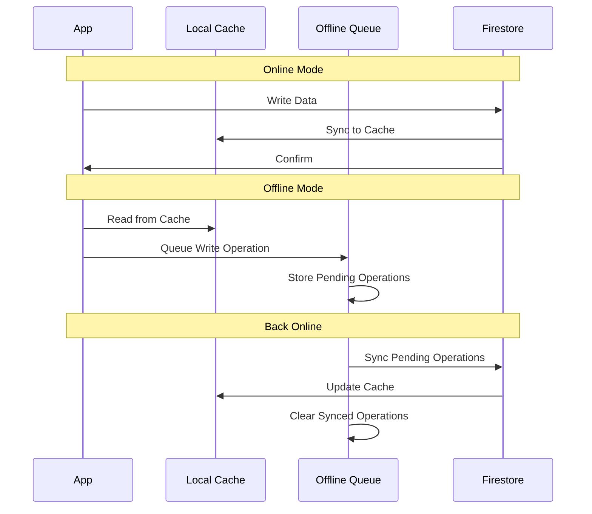
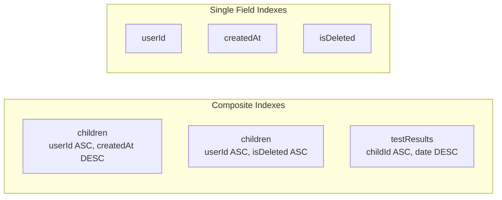

# Database Schema Diagrams

## Firestore Collections Structure



## Detailed Collection Schemas

### Users Collection


### Children Collection


### Test Results Collection


## Data Flow



## Security Rules Structure



## Local Storage Structure

```mermaid
graph TB
    subgraph "SharedPreferences"
        Theme[theme_mode<br/>light/dark]
        Language[language<br/>en/ar]
        Onboarding[onboarding_complete<br/>true/false]
        OfflineQueue[offline_queue<br/>JSON array]
    end

    subgraph "App Documents Directory"
        PDFs[/reports/<br/>PDF files]
    end

    subgraph "Firestore Cache"
        FirestoreCache[Local Cache<br/>Automatic]
    end
```

## Data Models (Dart Classes)



## Offline Sync Strategy



## Index Requirements


