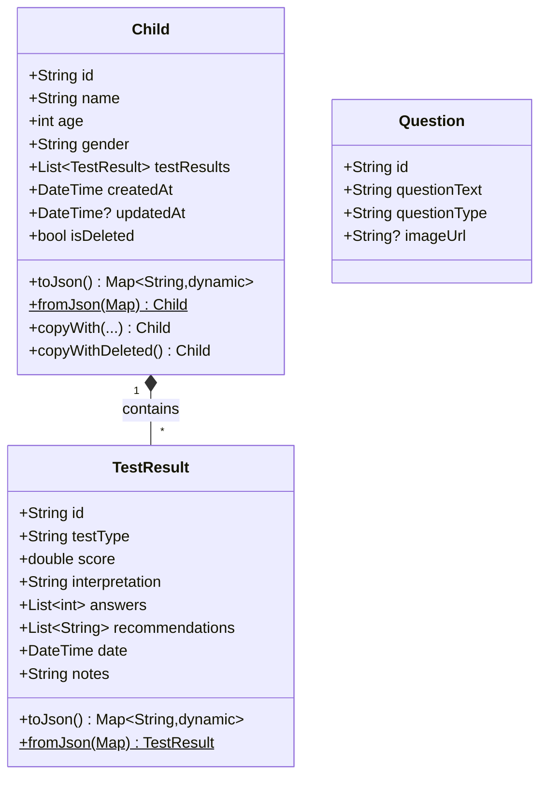
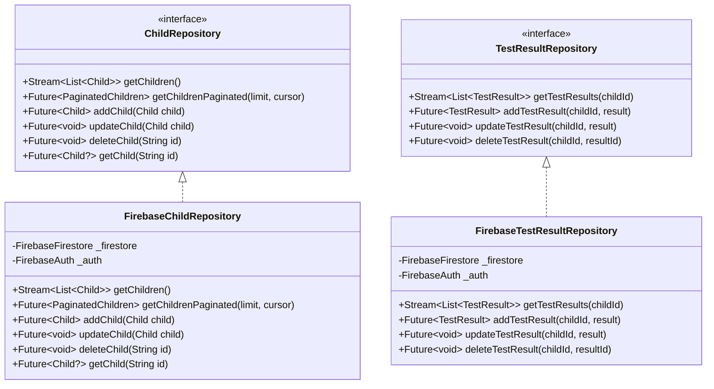
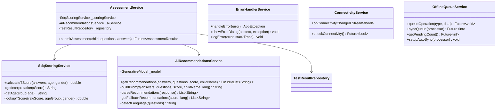
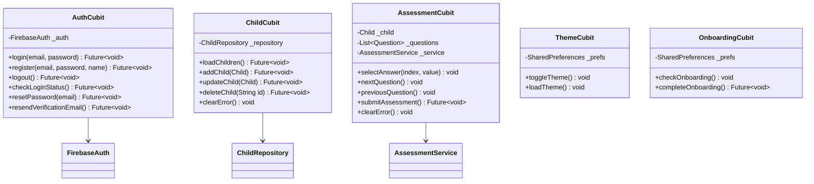
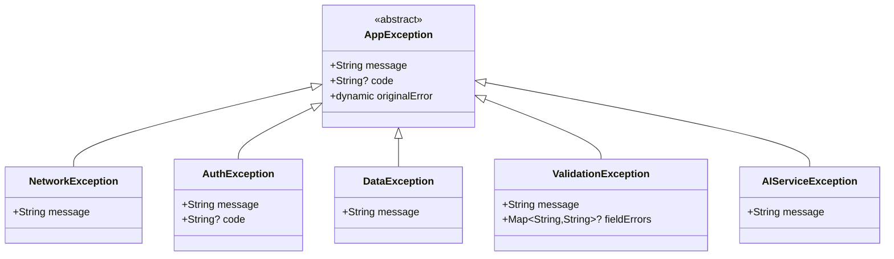
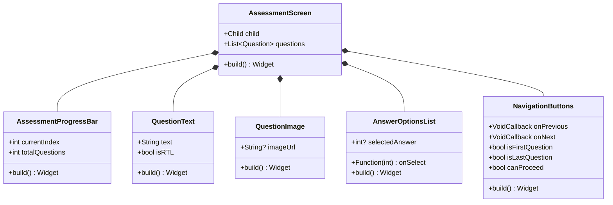
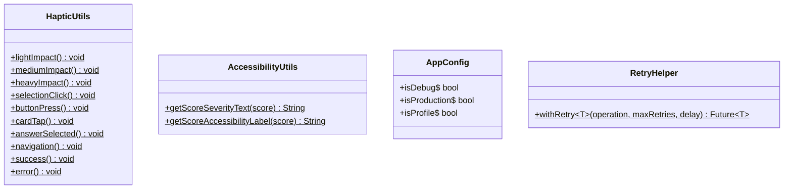

# Class Diagrams

## Core Domain Models

```mermaid
classDiagram
    class Child {
        +String id
        +String name
        +int age
        +String gender
        +List~TestResult~ testResults
        +DateTime createdAt
        +DateTime? updatedAt
        +bool isDeleted
        +toJson() Map~String,dynamic~
        +fromJson(Map) Child$
        +copyWith(...) Child
        +copyWithDeleted() Child
    }

    class TestResult {
        +String id
        +String testType
        +double score
        +String interpretation
        +List~int~ answers
        +List~String~ recommendations
        +DateTime date
        +String notes
        +toJson() Map~String,dynamic~
        +fromJson(Map) TestResult$
    }

    class Question {
        +String id
        +String questionText
        +String questionType
        +String? imageUrl
    }

    Child "1" *-- "*" TestResult : contains
```

## Repository Pattern

```mermaid
classDiagram
    class ChildRepository {
        <<interface>>
        +Stream~List~Child~~ getChildren()
        +Future~PaginatedChildren~ getChildrenPaginated(limit, cursor)
        +Future~Child~ addChild(Child child)
        +Future~void~ updateChild(Child child)
        +Future~void~ deleteChild(String id)
        +Future~Child?~ getChild(String id)
    }

    class FirebaseChildRepository {
        -FirebaseFirestore _firestore
        -FirebaseAuth _auth
        +Stream~List~Child~~ getChildren()
        +Future~PaginatedChildren~ getChildrenPaginated(limit, cursor)
        +Future~Child~ addChild(Child child)
        +Future~void~ updateChild(Child child)
        +Future~void~ deleteChild(String id)
        +Future~Child?~ getChild(String id)
    }

    class TestResultRepository {
        <<interface>>
        +Stream~List~TestResult~~ getTestResults(childId)
        +Future~TestResult~ addTestResult(childId, result)
        +Future~void~ updateTestResult(childId, result)
        +Future~void~ deleteTestResult(childId, resultId)
    }

    class FirebaseTestResultRepository {
        -FirebaseFirestore _firestore
        -FirebaseAuth _auth
        +Stream~List~TestResult~~ getTestResults(childId)
        +Future~TestResult~ addTestResult(childId, result)
        +Future~void~ updateTestResult(childId, result)
        +Future~void~ deleteTestResult(childId, resultId)
    }

    ChildRepository <|.. FirebaseChildRepository
    TestResultRepository <|.. FirebaseTestResultRepository
```

## Service Layer

```mermaid
classDiagram
    class SdqScoringService {
        +calculateTScore(answers, age, gender) double
        +getInterpretation(tScore) String
        -getAgeGroup(age) String
        -lookupTScore(rawScore, ageGroup, gender) double
    }

    class AiRecommendationsService {
        -GenerativeModel _model
        +getRecommendations(answers, questions, score, childName) Future~List~String~~
        -buildPrompt(answers, questions, score, childName, lang) String
        -parseRecommendations(response) List~String~
        -getFallbackRecommendations(score, lang) List~String~
        -detectLanguage(questions) String
    }

    class AssessmentService {
        -SdqScoringService _scoringService
        -AiRecommendationsService _aiService
        -TestResultRepository _repository
        +submitAssessment(child, questions, answers) Future~AssessmentResult~
    }

    class ErrorHandlerService {
        +handleError(error) AppException
        +showErrorDialog(context, exception) void
        +logError(error, stackTrace) void
    }

    class ConnectivityService {
        +checkConnectivity() Future~bool~
        +onConnectivityChanged Stream~bool~
    }

    class OfflineQueueService {
        +queueOperation(type, data) Future~void~
        +syncQueue(processor) Future~int~
        +getPendingCount() Future~int~
        +setupAutoSync(processor) void
    }

    AssessmentService --> SdqScoringService
    AssessmentService --> AiRecommendationsService
    AssessmentService --> TestResultRepository
```

## Cubit Layer

```mermaid
classDiagram
    class AuthCubit {
        -FirebaseAuth _auth
        +login(email, password) Future~void~
        +register(email, password, name) Future~void~
        +logout() Future~void~
        +checkLoginStatus() Future~void~
        +resetPassword(email) Future~void~
        +resendVerificationEmail() Future~void~
    }

    class ChildCubit {
        -ChildRepository _repository
        +loadChildren() Future~void~
        +addChild(Child) Future~void~
        +updateChild(Child) Future~void~
        +deleteChild(String id) Future~void~
        +clearError() void
    }

    class AssessmentCubit {
        -Child _child
        -List~Question~ _questions
        -AssessmentService _service
        +selectAnswer(index, value) void
        +nextQuestion() void
        +previousQuestion() void
        +submitAssessment() Future~void~
        +clearError() void
    }

    class ThemeCubit {
        -SharedPreferences _prefs
        +toggleTheme() void
        +loadTheme() void
    }

    class OnboardingCubit {
        -SharedPreferences _prefs
        +checkOnboarding() void
        +completeOnboarding() Future~void~
    }

    AuthCubit --> FirebaseAuth
    ChildCubit --> ChildRepository
    AssessmentCubit --> AssessmentService
```

## Exception Classes

```mermaid
classDiagram
    class AppException {
        <<abstract>>
        +String message
        +String? code
        +dynamic originalError
    }

    class NetworkException {
        +String message
    }

    class AuthException {
        +String message
        +String? code
    }

    class DataException {
        +String message
    }

    class ValidationException {
        +String message
        +Map~String,String~? fieldErrors
    }

    class AIServiceException {
        +String message
    }

    AppException <|-- NetworkException
    AppException <|-- AuthException
    AppException <|-- DataException
    AppException <|-- ValidationException
    AppException <|-- AIServiceException
```

## UI Widget Hierarchy

```mermaid
classDiagram
    class AssessmentScreen {
        +Child child
        +List~Question~ questions
        +build() Widget
    }

    class AssessmentProgressBar {
        +int currentIndex
        +int totalQuestions
        +build() Widget
    }

    class QuestionText {
        +String text
        +bool isRTL
        +build() Widget
    }

    class QuestionImage {
        +String? imageUrl
        +build() Widget
    }

    class AnswerOptionsList {
        +int? selectedAnswer
        +Function(int) onSelect
        +build() Widget
    }

    class NavigationButtons {
        +VoidCallback onPrevious
        +VoidCallback onNext
        +bool isFirstQuestion
        +bool isLastQuestion
        +bool canProceed
        +build() Widget
    }

    AssessmentScreen *-- AssessmentProgressBar
    AssessmentScreen *-- QuestionText
    AssessmentScreen *-- QuestionImage
    AssessmentScreen *-- AnswerOptionsList
    AssessmentScreen *-- NavigationButtons
```

## Utility Classes

```mermaid
classDiagram
    class HapticUtils {
        +lightImpact()$ void
        +mediumImpact()$ void
        +heavyImpact()$ void
        +selectionClick()$ void
        +buttonPress()$ void
        +cardTap()$ void
        +answerSelected()$ void
        +navigation()$ void
        +success()$ void
        +error()$ void
    }

    class AccessibilityUtils {
        +getScoreSeverityText(score)$ String
        +getScoreAccessibilityLabel(score)$ String
    }

    class AppConfig {
        +isDebug$ bool
        +isProduction$ bool
        +isProfile$ bool
    }

    class RetryHelper {
        +withRetry~T~(operation, maxRetries, delay)$ Future~T~
    }
```
