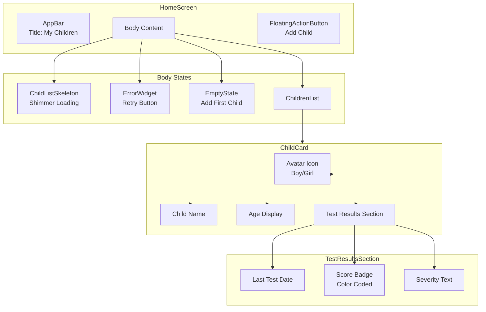
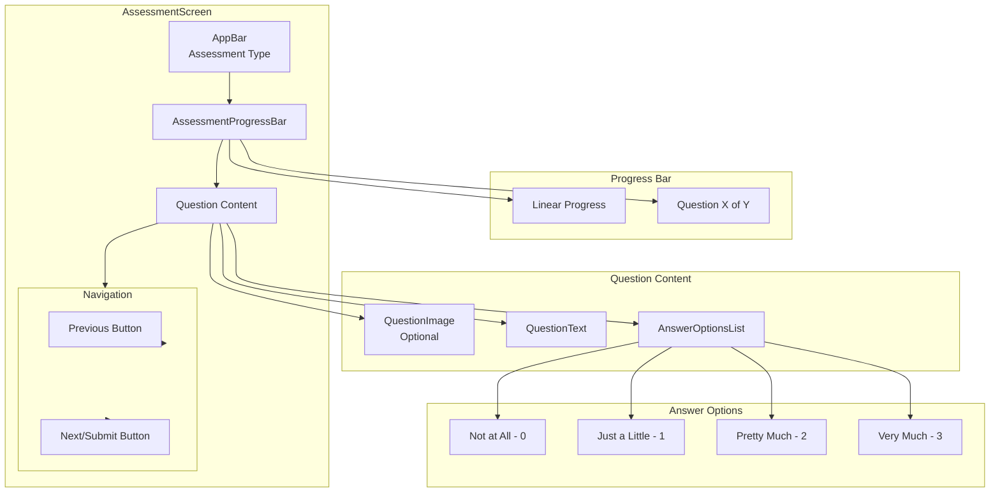
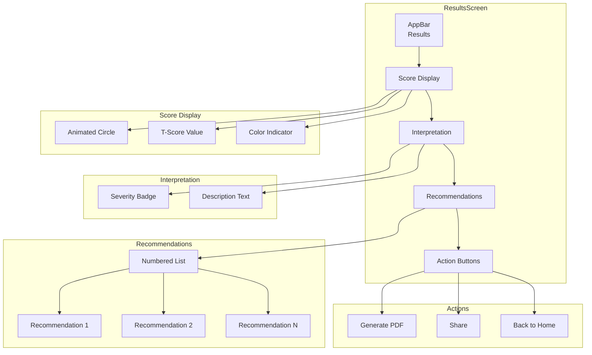
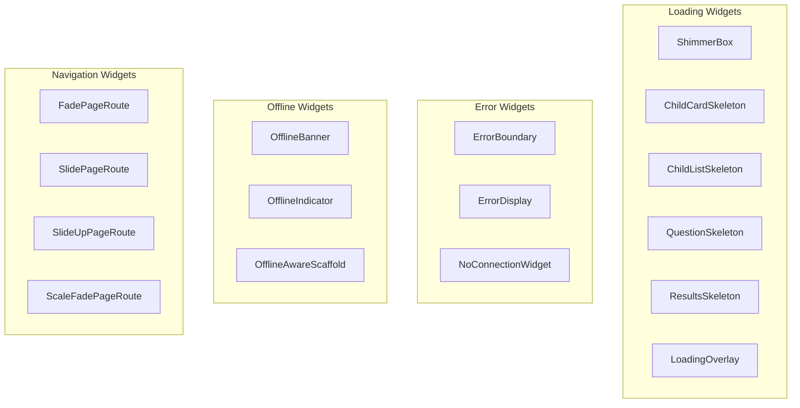
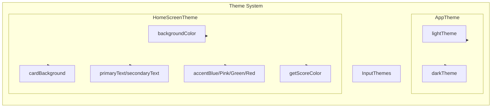
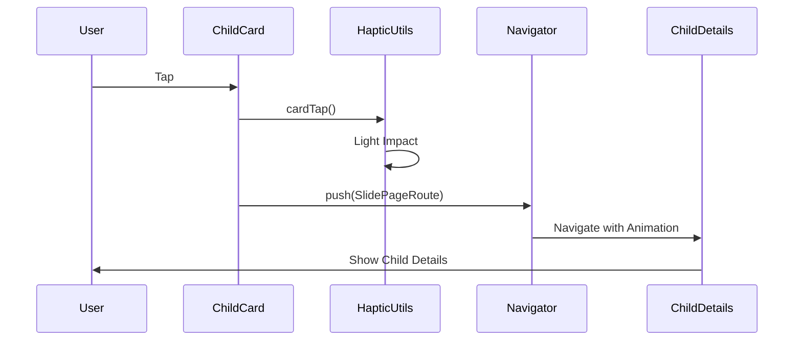

# Component Diagrams

## Screen Components Overview

```mermaid
graph TB
    subgraph "App Entry"
        Main[main.dart]
        KhutaApp[KhutaApp]
    end

    subgraph "Navigation"
        MainScreen[MainScreen<br/>Bottom Navigation]
    end

    subgraph "Auth Screens"
        Splash[SplashScreen]
        Login[LoginScreen]
        Register[RegisterScreen]
        VerifyEmail[VerifyEmailScreen]
        ForgotPassword[ForgotPasswordScreen]
    end

    subgraph "Onboarding"
        Onboarding[OnboardingScreen]
    end

    subgraph "Main Screens"
        Home[HomeScreen]
        Settings[SettingsScreen]
    end

    subgraph "Child Screens"
        AddChild[AddChildScreen]
        ChildDetails[ChildDetailsScreen]
    end

    subgraph "Assessment Screens"
        Assessment[AssessmentScreen]
        Results[ResultsScreen]
    end

    subgraph "Legal Screens"
        Privacy[PrivacyPolicyScreen]
        Terms[TermsScreen]
        MarkdownView[MarkdownViewScreen]
    end

    Main --> KhutaApp
    KhutaApp --> Splash
    Splash --> Onboarding
    Splash --> Login
    Onboarding --> Login
    Login --> Register
    Login --> ForgotPassword
    Login --> MainScreen
    Register --> VerifyEmail
    VerifyEmail --> Login

    MainScreen --> Home
    MainScreen --> Settings

    Home --> AddChild
    Home --> ChildDetails
    ChildDetails --> Assessment
    Assessment --> Results
    Results --> ChildDetails

    Settings --> Privacy
    Settings --> Terms
```

## HomeScreen Components



## AssessmentScreen Components



## ResultsScreen Components



## Shared Widgets



## Theme Components



## Widget Interactions


