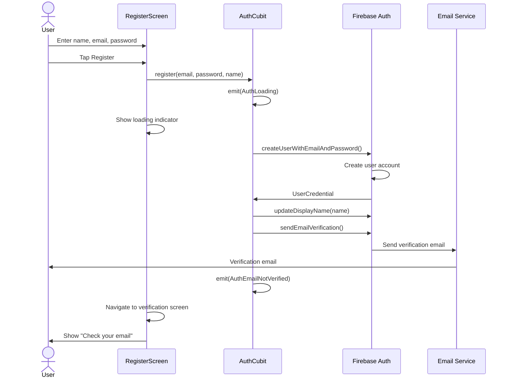
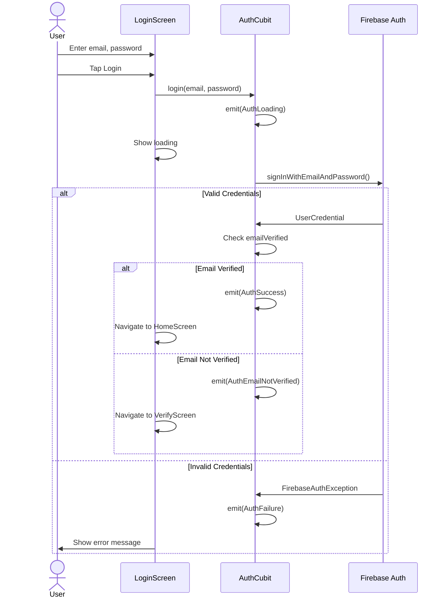
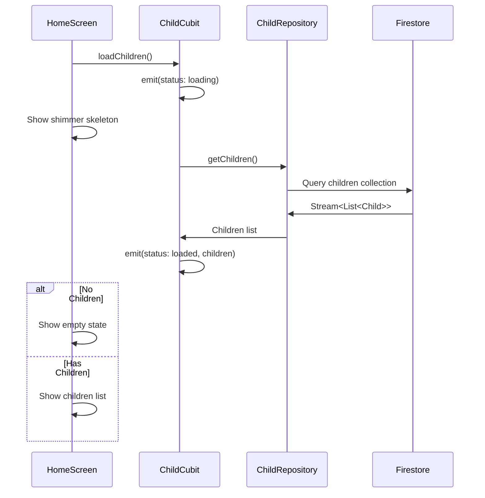
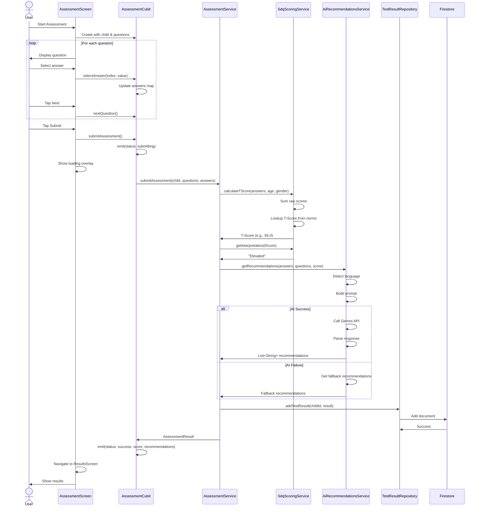
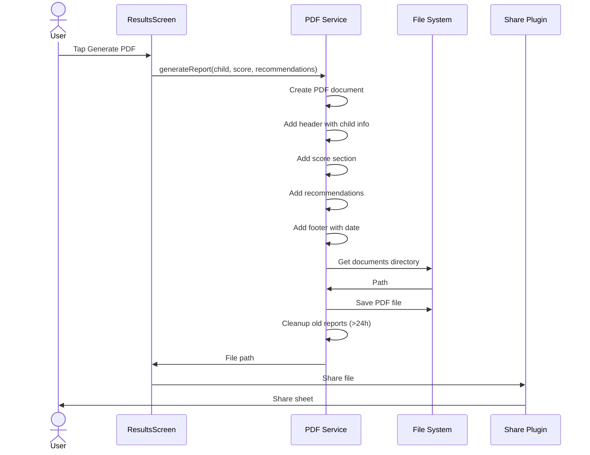
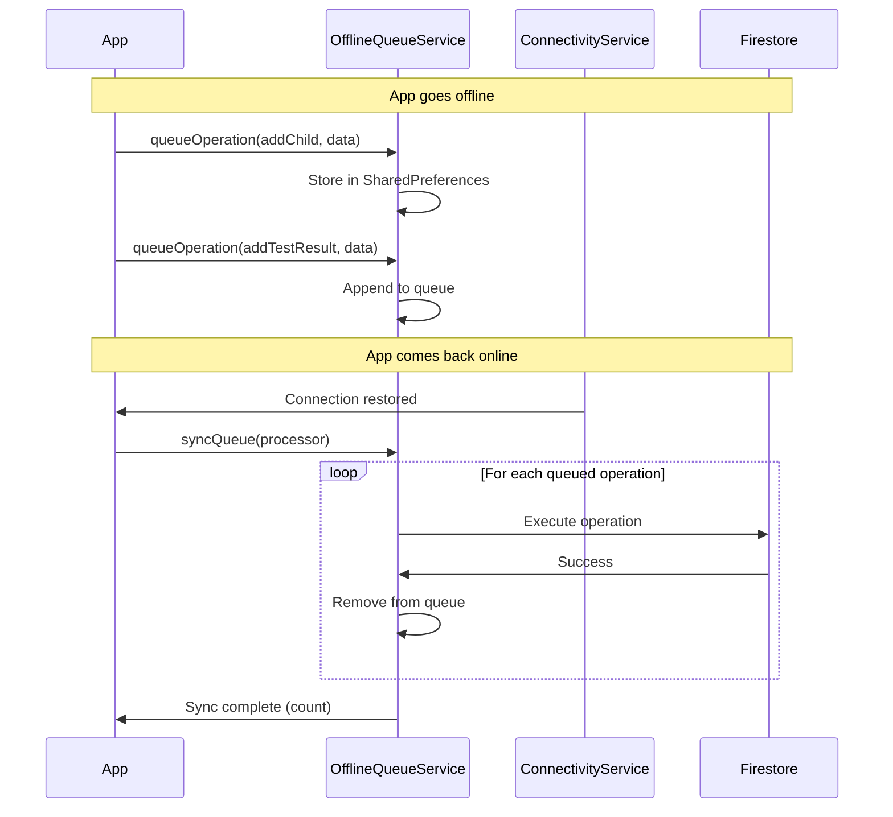
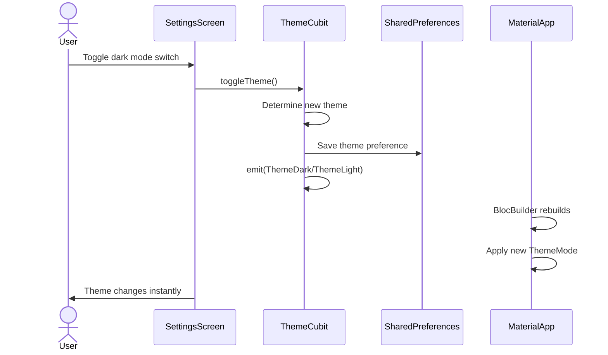
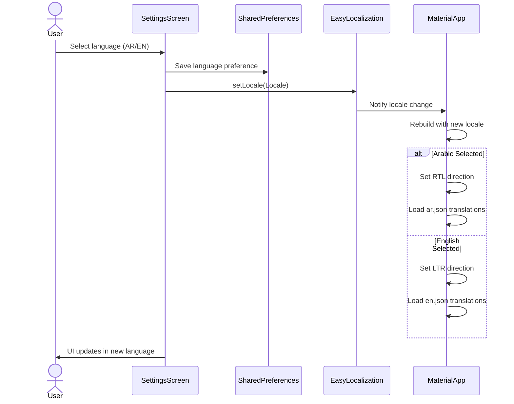

# Sequence Diagrams

## User Registration Sequence

## Login Sequence

## Load Children Sequence

## Complete Assessment Sequence

## Generate PDF Sequence

## Offline Sync Sequence

## Theme Toggle Sequence

## Language Change Sequence

