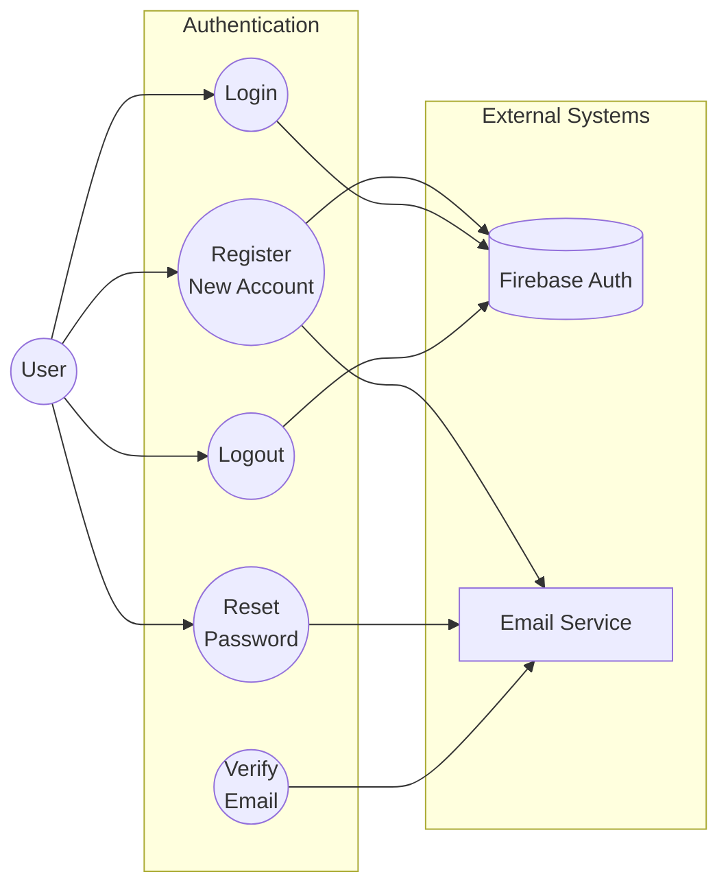
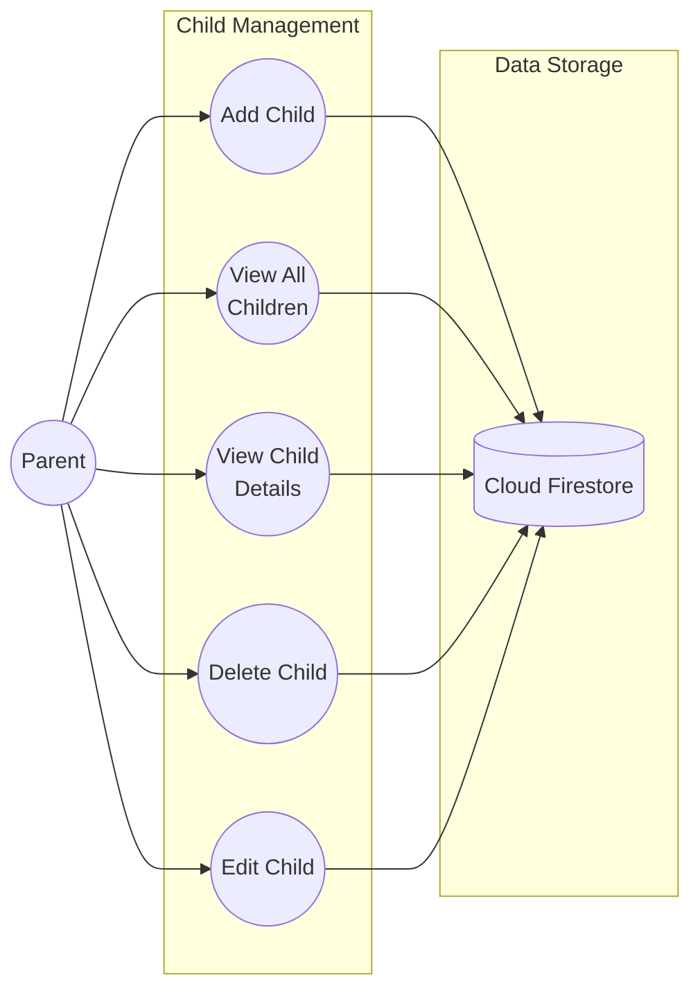
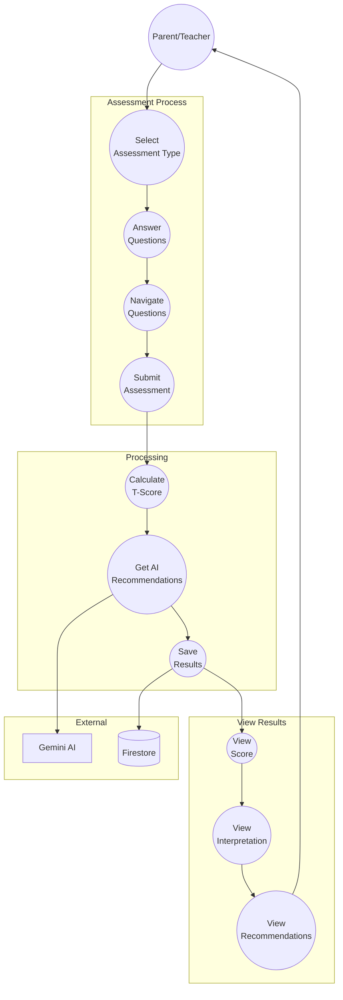
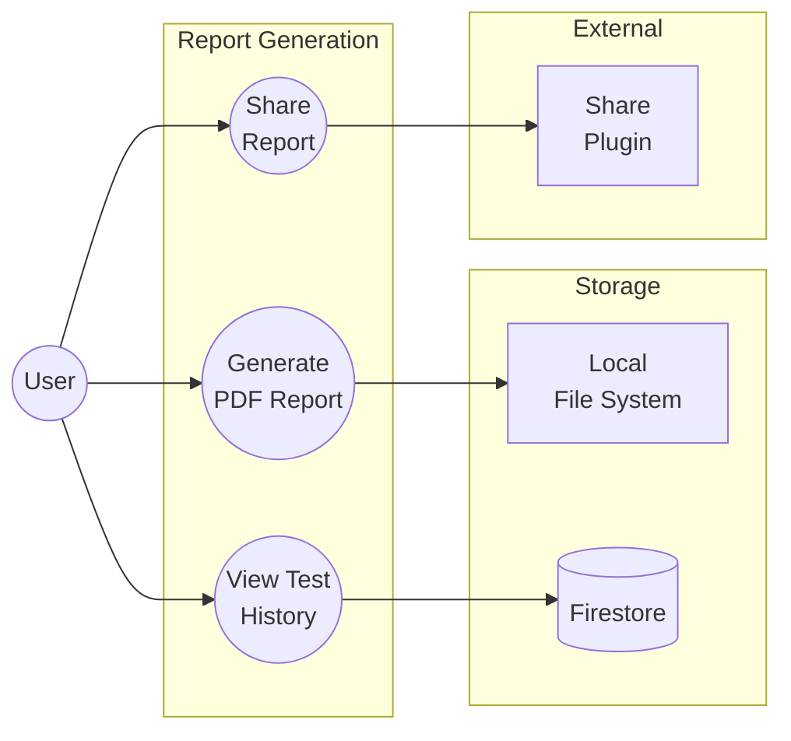

# Use Case Diagrams

## System Use Cases

```mermaid
graph TB
    subgraph "Khuta ADHD Assessment System"
        subgraph "Authentication"
            UC1((Register))
            UC2((Login))
            UC3((Logout))
            UC4((Reset Password))
            UC5((Verify Email))
        end

        subgraph "Child Management"
            UC6((Add Child))
            UC7((View Children))
            UC8((View Child Details))
            UC9((Delete Child))
        end

        subgraph "Assessment"
            UC10((Start Assessment))
            UC11((Answer Questions))
            UC12((Submit Assessment))
            UC13((View Results))
            UC14((View Recommendations))
        end

        subgraph "Reports"
            UC15((Generate PDF))
            UC16((Share Report))
            UC17((View History))
        end

        subgraph "Settings"
            UC18((Change Theme))
            UC19((Change Language))
            UC20((View Privacy Policy))
        end
    end

    User((User/Parent))

    User --> UC1
    User --> UC2
    User --> UC3
    User --> UC4
    User --> UC5
    User --> UC6
    User --> UC7
    User --> UC8
    User --> UC9
    User --> UC10
    User --> UC11
    User --> UC12
    User --> UC13
    User --> UC14
    User --> UC15
    User --> UC16
    User --> UC17
    User --> UC18
    User --> UC19
    User --> UC20
```

## Detailed Use Cases

### Authentication Use Cases

### Child Management Use Cases

### Assessment Use Cases

### Report Use Cases

## Actor Descriptions

| Actor | Description |
|-------|-------------|
| **Parent** | Primary user who registers, adds children, and conducts parent assessments |
| **Teacher** | Secondary user who can conduct teacher assessments (using parent's account) |
| **Firebase Auth** | External authentication service |
| **Firestore** | Cloud database for storing user data |
| **Gemini AI** | AI service for generating recommendations |
| **Email Service** | Email verification and password reset |

## Use Case Specifications

### UC1: Register New Account
| Field | Description |
|-------|-------------|
| **Actor** | User (Parent) |
| **Precondition** | User has valid email address |
| **Main Flow** | 1. User enters name, email, password 2. System validates input 3. System creates account 4. System sends verification email 5. User verifies email |
| **Postcondition** | Account created and verified |
| **Extensions** | Email already in use, Weak password |

### UC10: Start Assessment
| Field | Description |
|-------|-------------|
| **Actor** | User (Parent/Teacher) |
| **Precondition** | User logged in, Child exists |
| **Main Flow** | 1. User selects child 2. User selects assessment type 3. System loads questions 4. User answers 27 questions 5. System calculates score 6. System gets AI recommendations 7. System saves results |
| **Postcondition** | Assessment completed and saved |
| **Extensions** | Network error, AI unavailable |

### UC15: Generate PDF Report
| Field | Description |
|-------|-------------|
| **Actor** | User |
| **Precondition** | Assessment completed |
| **Main Flow** | 1. User taps Generate PDF 2. System creates PDF document 3. System saves to local storage 4. System offers share options |
| **Postcondition** | PDF saved and shareable |
| **Extensions** | Storage full |
