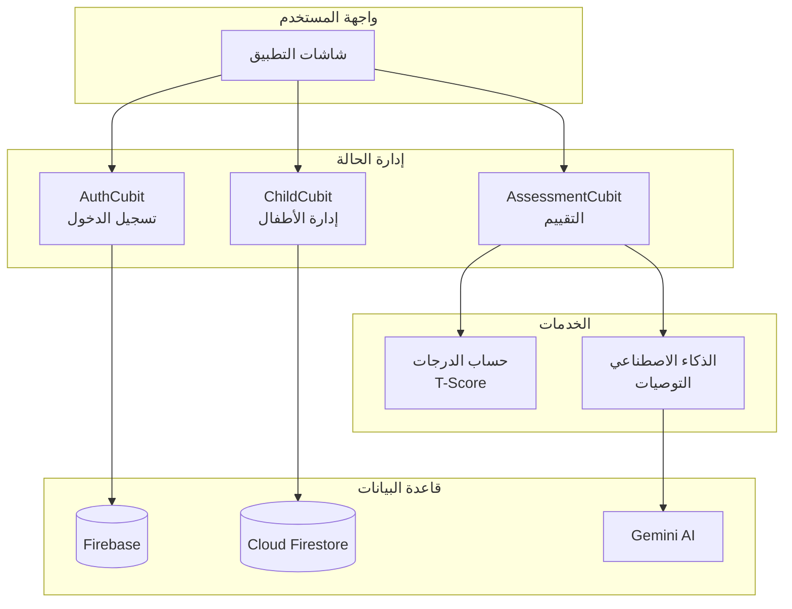
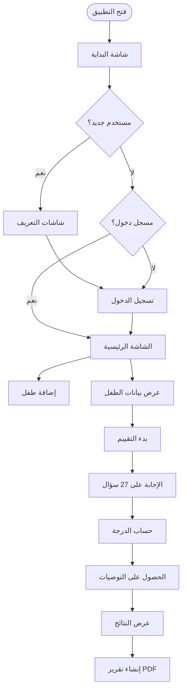
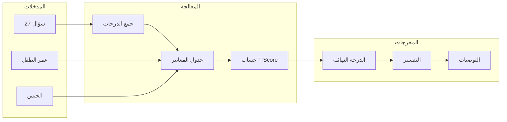
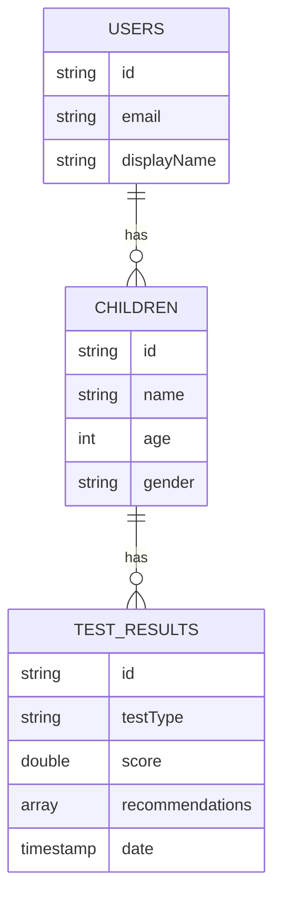
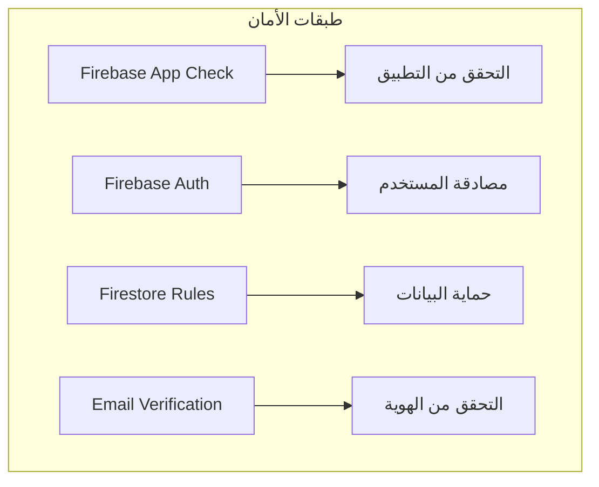
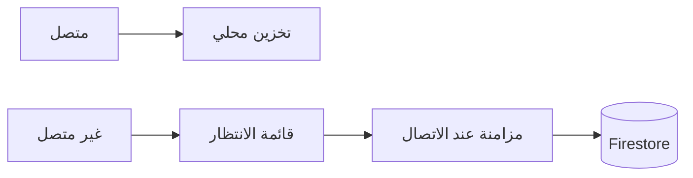

# ملخص العرض التقديمي - تطبيق خطى

## نظرة عامة على المشروع

**اسم التطبيق:** خطى (Khuta)
**الوصف:** تطبيق موبايل لتقييم اضطراب فرط الحركة وتشتت الانتباه (ADHD) باستخدام مقياس كونرز مع توصيات ذكية

---

## 1. هيكل النظام (System Architecture)

---

## 2. مسار المستخدم (User Flow)

---

## 3. عملية التقييم (Assessment Process)

---

## 4. تفسير الدرجات (Score Interpretation)

| الدرجة (T-Score) | اللون | التفسير |
|------------------|-------|---------|
| أقل من 45 | 🟢 أخضر | متوسط - قلق منخفض |
| 45 - 55 | 🟡 أصفر | مرتفع قليلاً - يحتاج متابعة |
| 55 - 65 | 🟠 برتقالي | مرتفع - يحتاج اهتمام |
| أكثر من 65 | 🔴 أحمر | مرتفع جداً - يحتاج تدخل |

---

## 5. هيكل قاعدة البيانات (Database Schema)

---

## 6. التقنيات المستخدمة (Technology Stack)

| المكون | التقنية |
|--------|---------|
| **الواجهة الأمامية** | Flutter (Dart) |
| **إدارة الحالة** | BLoC / Cubit |
| **قاعدة البيانات** | Firebase Firestore |
| **المصادقة** | Firebase Auth |
| **الذكاء الاصطناعي** | Google Gemini 2.0 |
| **التقارير** | PDF Generation |
| **اللغات** | العربية والإنجليزية |

---

## 7. الميزات الرئيسية (Key Features)

### ✅ المصادقة
- تسجيل حساب جديد
- تسجيل الدخول
- التحقق من البريد الإلكتروني
- استعادة كلمة المرور

### ✅ إدارة الأطفال
- إضافة طفل جديد
- عرض قائمة الأطفال
- عرض تفاصيل الطفل
- حذف طفل

### ✅ التقييم
- تقييم الوالدين (27 سؤال)
- تقييم المعلم (27 سؤال)
- حساب T-Score
- توصيات ذكية من AI

### ✅ التقارير
- عرض النتائج
- إنشاء تقرير PDF
- مشاركة النتائج
- سجل التقييمات السابقة

### ✅ الإعدادات
- الوضع الليلي
- تغيير اللغة (عربي/إنجليزي)
- سياسة الخصوصية

---

## 8. الأمان (Security)

---

## 9. دعم وضع عدم الاتصال (Offline Support)

---

## 10. شاشات التطبيق (App Screens)

1. **شاشة البداية** - Splash Screen
2. **شاشات التعريف** - Onboarding (3 شاشات)
3. **تسجيل الدخول** - Login
4. **إنشاء حساب** - Register
5. **الشاشة الرئيسية** - Home (قائمة الأطفال)
6. **إضافة طفل** - Add Child
7. **تفاصيل الطفل** - Child Details
8. **التقييم** - Assessment (27 سؤال)
9. **النتائج** - Results
10. **الإعدادات** - Settings

---

## للمزيد من التفاصيل

راجع الملفات التالية:
- `01-app-architecture.md` - هيكل النظام
- `02-user-flow.md` - مسار المستخدم
- `03-authentication-flow.md` - نظام المصادقة
- `04-assessment-flow.md` - عملية التقييم
- `05-state-management.md` - إدارة الحالة
- `06-database-schema.md` - قاعدة البيانات
- `07-class-diagram.md` - مخطط الفئات
- `08-component-diagram.md` - مخطط المكونات
- `09-sequence-diagrams.md` - مخططات التسلسل
- `10-use-case-diagram.md` - حالات الاستخدام
